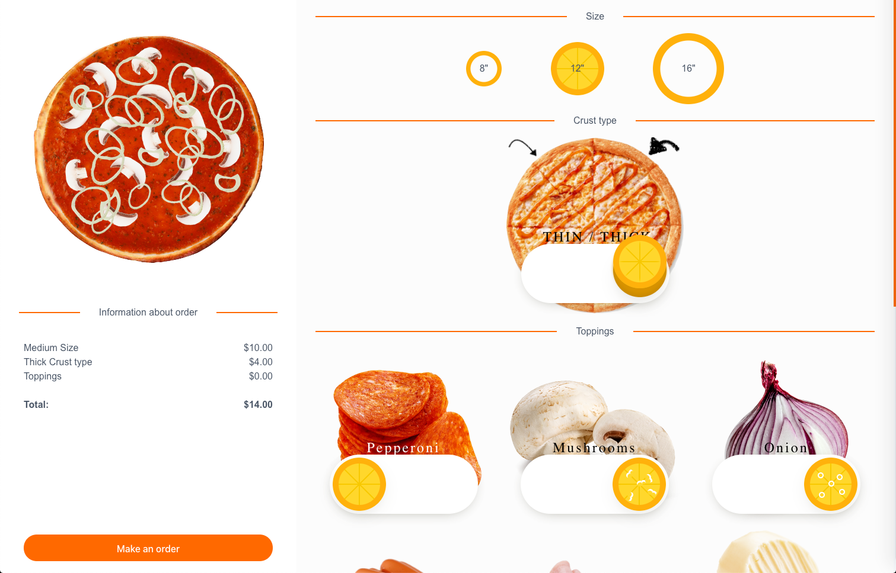
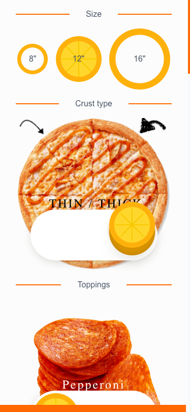
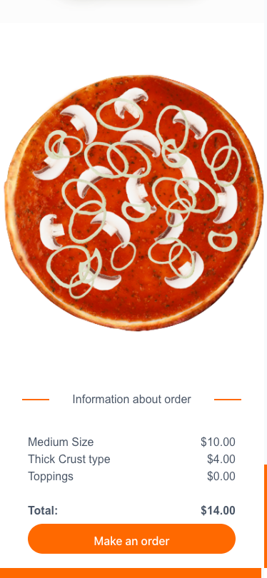

# pizza order

The project was created for a test task for some company as a front-end developer 
[task](./TASK.md)

## How to run project
```
cd front
yarn
yarn start
```

open in browser:  
http://localhost:3000/

preview desktop:  


preview mobile:  
  

