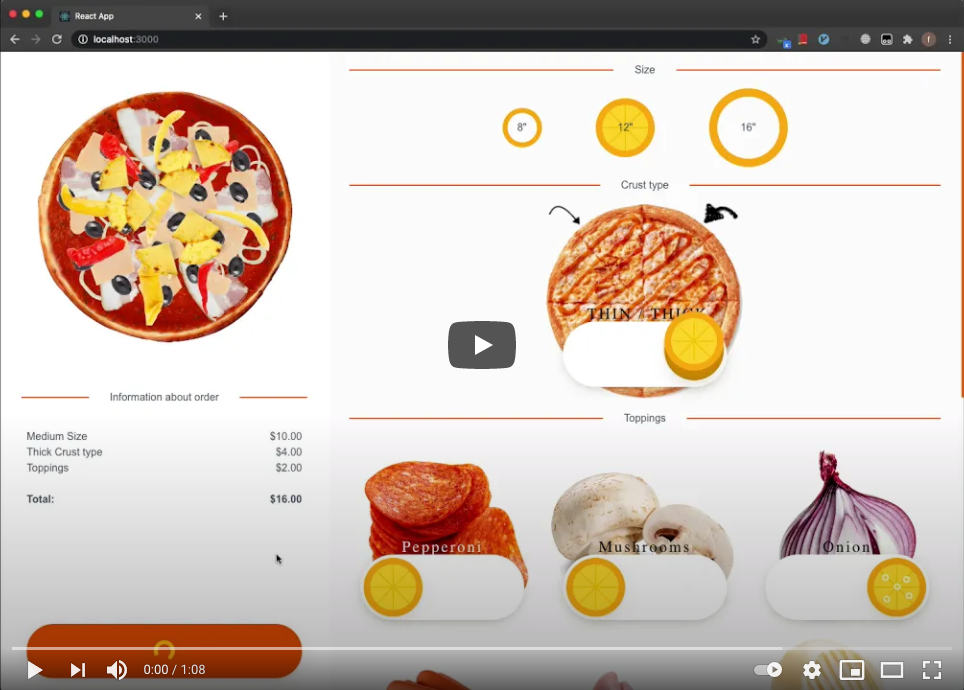

# pizza order

Make your own pizza and order it!

[live demo](https://fosemberg.github.io/pizza-order/)

[Video demonstrating project work](https://youtu.be/w3uJLB2OQV4)  
[](https://youtu.be/w3uJLB2OQV4)

[technical task](./TASK.md)

## Technologies

- **typescript** differs from JavaScript by the possibility of explicit static type assignment, which is intended to increase development speed, facilitate readability, refactoring and reuse of code, and help find errors at the development and compilation stage. It was especially useful for writing interfaces that are used simultaneously in 2 different places: back, front.
- **express** is a fast, flexible, minimalistic web framework for Node.js applications. Used to implement API, communication between front and back.
- **nedb** is an embedded database for NodeJS that implements a subset of the MongoDB API. This lightweight NoSQL DBMS is written in pure JavaScript and has no binary dependencies. Used to store orders from users.
- **creat react app** is a great tool for getting started quickly in React applications. Thanks to creat, the react app has saved a lot of time setting up the environment for React.
- **react bootstrap** - design system. Saved a lot of time to create a responsive and beautiful interface.

## Dependencies

- [nodejs](https://nodejs.org/en/)
- [git](https://git-scm.com/downloads)
- [npm](https://www.npmjs.com/get-npm) (usually installed with nodejs)
- [yarn](https://www.npmjs.com/package/yarn) (optional, instead of yarn can be used in all commands below npm)

## Launch

### Launch back

```npm
cd back &&
yarn &&
yarn run dev
```

### Launch front

```npm
cd front &&
yarn &&
yarn run start
```

open in browser:  
http://localhost:3000/

preview desktop:  


preview mobile:  
  

